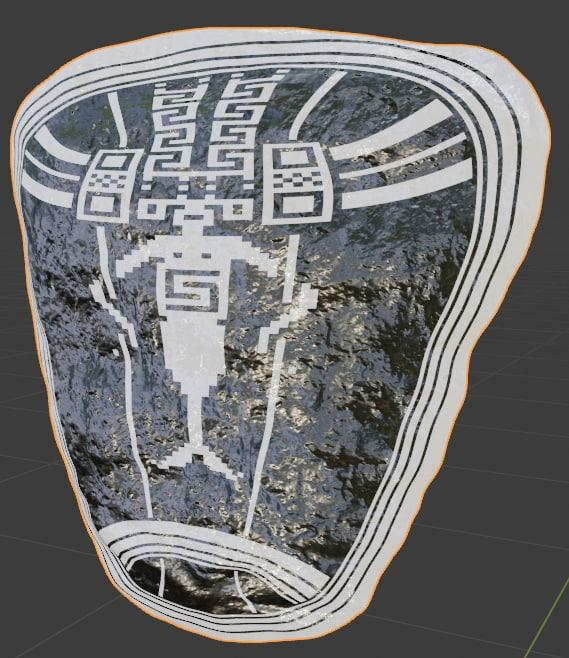
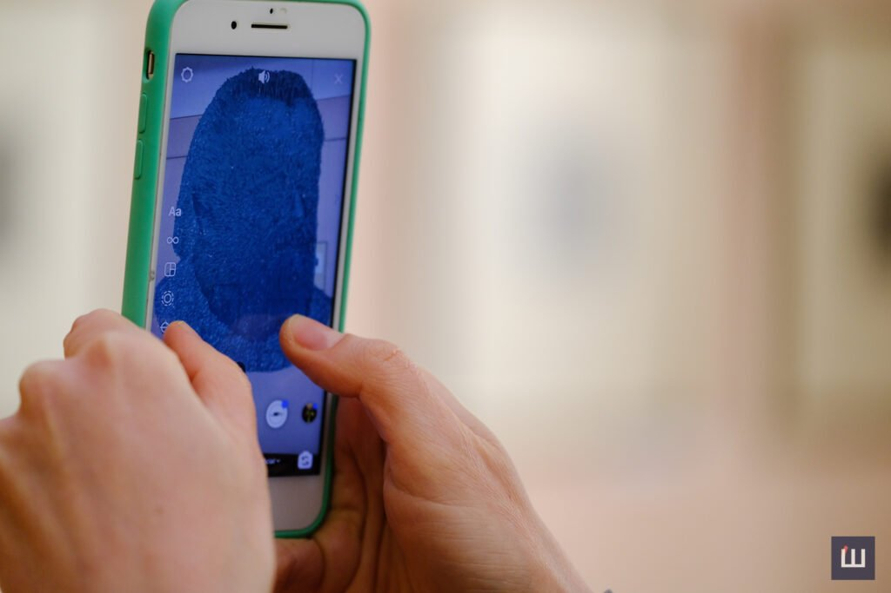

# VR Art Incubator
## _Handbook_

VR Art Incubator project active phase happened 7-14 April 2021 in Chernivtsi. The concept of VRArt Incubator was to launch a strong networking and cooperation process between VR/AR artists and beneficiaries of VR/AR products (i.e. galleries. museums, libraries, private and governmental operators of culture). Selected residents [Vera DG](https://www.facebook.com/verunja.dg) and [Nikita Khudiakov](https://www.facebook.com/voobrazhenie) were granted with individual stipendium for creating their own immersive project or interpretation of some works from Chernivtsi regional art museum`s and Chernivtsi Regional Local Lore Museum’s funds.

The project supported by the [Harald Binder Cultural Enterprises Grant Program (HBCE)](www.hbce.com.ua) and IM Swedish Development Partner. The HBCE organization was founded by historian and philanthropist Harald Binder to support interdisciplinary projects in the field of culture, art and education and foster the sustainable development of these areas in Ukraine. The grant program of the HBCE program is held once a year, the amount of the grant may range from 500 to 5000 euro on initiatives that are implemented in Ukraine within defined timeframes. One of the main objectives of HBCE is the support of development of contemporary art institution - [Jam Factory Art Center](http://www.jamfactory.ua/) in Lviv.

## Token of Tripyllya

In the Chernivtsi Regional Museum of Local Lore, Nikita Khudyakov chose an ancient ax tip, which is over 6,000 years old, and combined it with a Trypillia painting.

Transferring this idea to augmented reality (AR), he created the first NFT-token in Chernivtsi (NFT-token is a unique personal code of a work of digital art that helps to consolidate the authorship of the work). 

>“Inspired by the shape and patterns of this object and other ancient objects of Trypillia culture I created a digital token, a three-dimensional object that rotates. During the experiments with Trypillia patterns, he developed own technique of combining geometric shapes, ”- Nikita Khudyakov, digital artist.

>By digging into the history of this region I started to investigate images and patterns of Trypillia. During experimentation with these patterns and painting the 3D object I developed a technique of painting individual polygons. Previously I used it in simpler forms but now I’ve decided to proceed with this practice and give it the name of Polygon art.

Now you can buy NFT on [hic et nunc](https://www.hicetnunc.xyz/objkt/30361)  for 10 tez

## Sidor Vorobkevych's "Native language" in AR"

Vera Degtyareva (Vera DG) has implemented the second xR-idea. This time, the artist created an audiovisual object associated with Sidor Vorobkevich.
[check here](https://www.instagram.com/ar/281593206853837/)

>"It was the museum that identified the cultural figures we would like to see in the latest technology. I was offered a choice of several figures. And I chose Vorobkevych, because May 2 will be the 185th anniversary of his birth. I was also given a song based on Sidor Vorobkevych's words "Native language". So, scanning the code, the visitor will see a portrait of the writer and the flying pyramids around. It is an immersive experience. And if we touch the screen, there will be other different effects. And in the background - the song "Native language", - said Vera Degtyareva.

Portrait of Vorobkevich in AR is the result of cooperation between the artist and artificial intelligence.
Vera hired AI, who created a 3D object from the graphic work. From each pixel of the graphic work, the artificial intelligence calculated the volume. Creating more than 738,000 triangles. This model had to be optimized to 37,000 triangles to be able to load into augmented reality. To create an immersive experience, AR contains a song based on Vorobkevych's words “Native language, native word! He who forgets you has not a heart in his chest, but only a stone” performed by Ukrainian singer Ivanka Chervinska.

